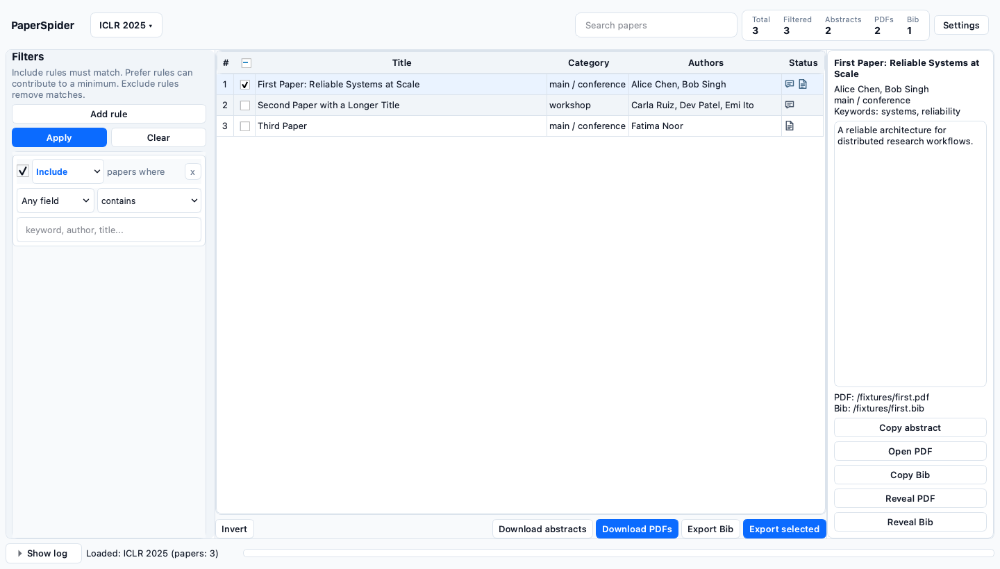

<h1 align="center">PaperSpider</h1>

<p align="center">
  
</p>

[English README](README.md) · [中文使用说明](docs/zh.md) · [English guide](docs/en.md)

PaperSpider 是一个会议论文桌面工具，用来获取论文列表、快速缩小范围，并批量下载或导出需要的论文信息。



## 主要用途

- 获取 AI、系统、安全、视觉和 NLP 领域主要会议的论文列表。
- 组合可复用的筛选规则，并用快速搜索进一步缩小结果。
- 下载单篇或批量下载论文摘要和 PDF。
- 将选中论文的元数据与摘要导出为 CSV、JSON 或纯文本列表。
- 按会议和年份将数据保存在本地 SQLite，并管理下载文件。

## 启动

可以从 [GitHub Releases](https://github.com/isaacveg/PaperSpider/releases/latest)
直接下载最新的 **macOS** 或 **Windows** 版本。

如需从源码运行，安装 [uv](https://docs.astral.sh/uv/) 后执行：

```bash
uv run paperspider
```

## 基本流程

1. 在 **Datasets** 中选择会议和年份，然后获取或打开论文列表。
2. 添加 **Include**、**Prefer** 或 **Exclude** 条件，点击 **Apply**。
3. 使用 **Search papers** 在筛选结果中继续搜索。
4. 勾选论文后批量下载摘要或 PDF；选中单行可使用右侧的单篇操作。
5. 点击 **Export selected**，导出标题、作者、摘要或简单标题列表。

筛选规则含义和完整操作见[中文使用说明](docs/zh.md)。

## 支持的会议

NeurIPS、ICML、ICLR、AAAI、IJCAI、CVPR、ICCV、EMNLP、ACL、NAACL、SIGCOMM、NSDI、OSDI、ATC、FAST、USENIX Security、NDSS 和 VLDB。

## 测试

```bash
uv run python -m unittest discover -s tests -v
```

本项目采用 Apache-2.0 许可证，详见 [LICENSE](LICENSE) 与 [NOTICE](NOTICE)。
